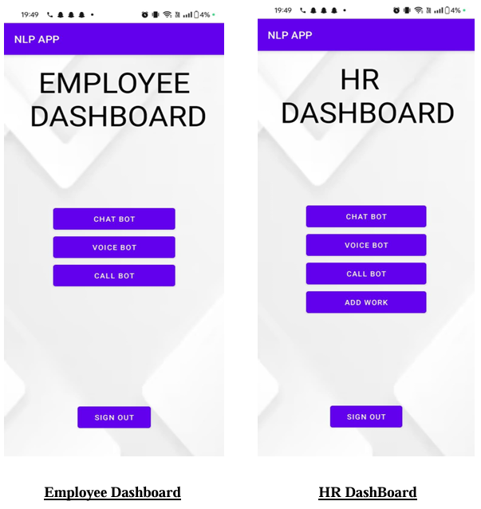
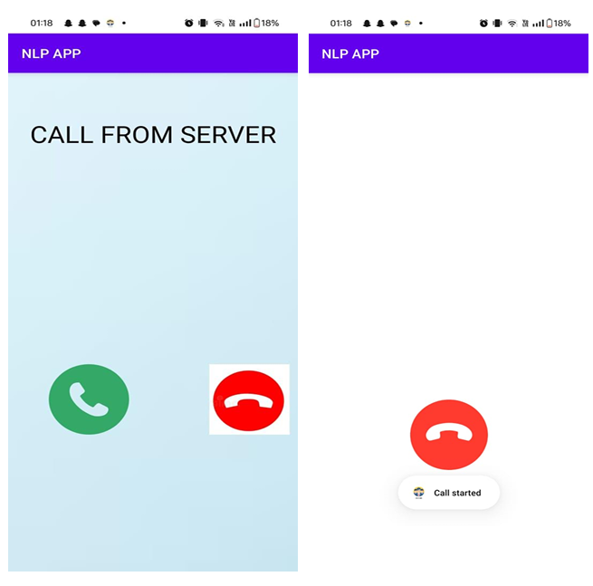

# NLP_HRE: Voice Bot for Employee Management

## Overview

**NLP_HRE** is an Android-based employee management system that integrates a Natural Language Processing (NLP)-powered voice bot to enhance communication and streamline HR processes. This application uses technologies such as **Node.js**, **Express.js**, **MongoDB**, **Dialogflow**, and **Google Firebase** to manage employee data, send automatic notifications, and generate work update emails.

## Features

* **NLP-based Voice Bot**: The voice bot allows employees and HR personnel to interact with the system using voice commands, providing a hands-free experience. The bot is powered by Dialogflow and responds to user queries in natural language.
* **Real-time Notifications**: The server initiates real-time notifications, reminders, and updates directly to the users through calls and push notifications.
* **Auto-generated Work Update Emails**: The application automatically generates and sends periodic work update emails to relevant stakeholders, ensuring transparency and efficient communication.
* **Secure Login**: Secure login interfaces for employees and HR personnel, with role-based access to different functionalities.
* **Cloud Integration**: Integration with a cloud-based MongoDB database for scalable and reliable storage of user data.

## Technologies Used

* **Backend**:
   * Node.js
   * Express.js
   * MongoDB (Cloud)
   * Google Firebase Cloud Messaging (FCM)
   * Dialogflow API (for NLP)
   * NodeMailer (for sending emails)
* **Frontend**:
   * Java (for Android app development)
   * XML (for UI design)
* **Authentication**:
   * Google Firebase Authentication

## System Architecture

1. **Mobile App (Client-side)**: Built using Java and XML for Android. It provides separate login interfaces for employees and HR personnel.
2. **Server-side**: Built using Node.js and Express.js, it handles user authentication, real-time communication, voice bot processing, and auto-generated email functionality.
3. **NLP Integration**: The system uses Dialogflow to interpret and respond to user commands in real-time.
4. **Database**: MongoDB Cloud is used for storing user data securely.

## Installation

### Prerequisites

* Node.js
* MongoDB
* Firebase Account
* Android Studio

### Steps to Install

1. **Clone the Repository**:
   ```bash
   git clone https://github.com/your-username/NLP_HRE.git
   ```

2. **Install Dependencies**:
   ```bash
   cd NLP_HRE
   npm install
   ```

3. **Set Up Environment Variables**: Create a `.env` file in the root directory and add your MongoDB connection string, Firebase credentials, and other necessary API keys.

4. **Run the Application**:
   ```bash
   npm start
   ```

5. **Run the Android App**: Open the `Android` folder in Android Studio and run the app on an emulator or device.

## Usage

* **Employee/HR Login**: Employees and HR personnel can log in via secure interfaces to access role-specific features.
* **Voice Commands**: Use the voice bot to interact with HR services using natural language.
* **Work Updates**: Employees will receive automatic emails and notifications about work status and updates.

## Screenshots

Here are some screenshots of the NLP_HRE application:




## Contribution

Feel free to fork the repository and submit pull requests for any improvements or new features.


